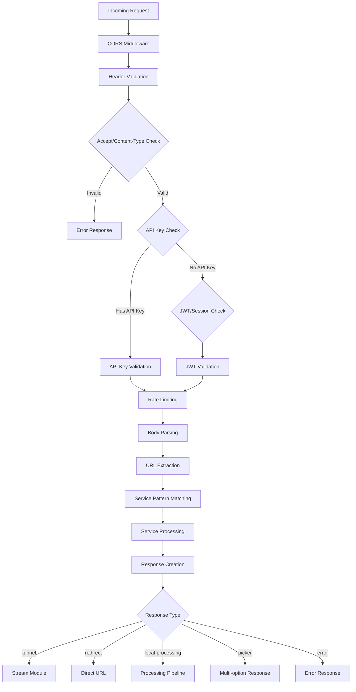

# Cobalt API Core Architecture Deep-Dive

## Bootstrap Process: cobalt.js → core/api.js

### 1. Initial Bootstrap (`api/src/cobalt.js`)

The bootstrap process begins in `cobalt.js`, which serves as the entry point:

```javascript
import "dotenv/config";  // Load environment variables
import express from "express";
import cluster from "node:cluster";

// Check if API_URL is configured
if (env.apiURL) {
    const { runAPI } = await import("./core/api.js");
    
    // Initialize cluster if configured
    if (isCluster) {
       await initCluster();
    }
    
    // Setup environment file watcher if configured
    if (env.envFile) {
        setupEnvWatcher();
    }
    
    // Launch API with cluster awareness
    runAPI(express, app, __dirname, cluster.isPrimary);
}
```

### 2. Cluster Support

The cluster initialization (`misc/cluster.js`) provides:

- **Multi-instance support**: Spawns `env.instanceCount - 1` worker processes
- **Port reuse**: Enables `reusePort` option for instances > 1
- **Secret synchronization**: Ensures all workers have synchronized secrets
- **Message broadcasting**: Inter-process communication between primary and workers

```javascript
export const initCluster = async () => {
    if (cluster.isPrimary) {
        for (let i = 1; i < env.instanceCount; ++i) {
            cluster.fork();
        }
    }
    await syncSecrets();
}
```

### 3. Environmental Configuration

The configuration system (`config.js`) manages:

- **Environment loading**: Via `loadEnvs()` and `validateEnvs()`
- **Dynamic updates**: `updateEnv()` allows runtime configuration changes
- **Special handling**: `tunnelPort` is preserved during updates
- **Version info**: Integrates with `@imput/version-info` for build metadata

## Core API Setup Pipeline (`core/api.js`)

### 1. CORS Configuration

```javascript
const corsConfig = env.corsWildcard ? {} : {
    origin: env.corsURL,
    optionsSuccessStatus: 200
}

app.use('/', cors({
    methods: ['GET', 'POST'],
    exposedHeaders: [
        'Ratelimit-Limit',
        'Ratelimit-Policy',
        'Ratelimit-Remaining',
        'Ratelimit-Reset'
    ],
    ...corsConfig,
}));
```

### 2. Dynamic Cipher Randomization

The system implements TLS cipher randomization (`misc/randomize-ciphers.js`):

- **Purpose**: Prevents TLS fingerprinting
- **Method**: Shuffles top 8 ciphers while maintaining the rest in order
- **Frequency**: Refreshed every 30 minutes via `setInterval`

```javascript
randomizeCiphers();
setInterval(randomizeCiphers, 1000 * 60 * 30);
```

### 3. Rate Limiting Stores

Three distinct rate limiters with configurable Redis/Memory stores:

#### Session Rate Limiter
```javascript
const sessionLimiter = rateLimit({
    windowMs: env.sessionRateLimitWindow * 1000,
    limit: env.sessionRateLimit,
    keyGenerator: (req) => hashHmac(getIP(req), 'rate').toString('base64url'),
    store: await createStore('session')
});
```

#### API Rate Limiter
```javascript
const apiLimiter = rateLimit({
    windowMs: env.rateLimitWindow * 1000,
    limit: (req) => req.rateLimitMax || env.rateLimitMax,
    keyGenerator: req => req.rateLimitKey || keyGenerator(req),
    store: await createStore('api')
});
```

#### Tunnel Rate Limiter
```javascript
const apiTunnelLimiter = rateLimit({
    windowMs: env.tunnelRateLimitWindow * 1000,
    limit: env.tunnelRateLimitMax,
    store: await createStore('tunnel')
});
```

**Store Creation**: Falls back to memory store if Redis is not configured:
```javascript
export const createStore = async (name) => {
    if (!env.redisURL) return;  // Falls back to memory store
    
    return new redisLimiter.default({
        prefix: `RL${name}_`,
        sendCommand: (...args) => client.sendCommand(args),
    });
}
```

### 4. HTTP Server Creation

```javascript
http.createServer(app).listen({
    port: env.apiPort,
    host: env.listenAddress,
    reusePort: env.instanceCount > 1 || undefined
});
```

## Middleware Chain

The API implements a sophisticated middleware pipeline for request processing:



### Detailed Middleware Flow:

1. **Header Validation** (`/` POST route)
   - Validates `Accept: application/json`
   - Validates `Content-Type: application/json`

2. **Authentication Layer**
   - **API Key**: Validates via `APIKeys.validateAuthorization()`
   - **JWT/Session**: Validates Bearer tokens with IP-based verification
   - Sets `req.rateLimitKey` for authenticated requests

3. **Body Parsing**
   - Limited to 1024 bytes
   - JSON parsing with error handling

4. **Rate Limiting**
   - Applied after authentication
   - Uses appropriate limiter based on request type

5. **Request Router (`match.js`)**
   - Extracts service from URL via `extract()`
   - Validates against service patterns
   - Routes to appropriate service handler

6. **Service Extractor (`url.js`)**
   - Normalizes URLs (alias resolution)
   - Cleans URLs (removes tracking params)
   - Validates host against service configuration

7. **Response Creator (`request.js`)**
   - Formats responses based on type
   - Handles error contexts
   - Creates stream URLs for tunnel responses

## Response Types

### 1. **Tunnel Response**
```json
{
    "status": "tunnel",
    "url": "https://api.cobalt.tools/tunnel?id=...&exp=...&sig=...&sec=...&iv=...",
    "filename": "video.mp4"
}
```
- Creates encrypted tunnel URL via `createStream()`
- Used for direct streaming without processing

### 2. **Local Processing Response**
```json
{
    "status": "local-processing",
    "type": "video",
    "service": "youtube",
    "tunnel": ["https://tunnel-url-1", "https://tunnel-url-2"],
    "output": {
        "type": "video/mp4",
        "filename": "youtube_video.mp4",
        "metadata": { /* optional metadata */ }
    },
    "audio": {
        "copy": false,
        "format": "mp3",
        "bitrate": "128"
    },
    "isHLS": false
}
```
- Provides tunnel URLs for client-side processing
- Includes audio transcoding parameters
- Supports HLS stream indicators

### 3. **Redirect Response**
```json
{
    "status": "redirect",
    "url": "https://direct-cdn-url.com/video.mp4",
    "filename": "video.mp4"
}
```
- Direct URL to content (no processing needed)
- Used when service provides direct download links

### 4. **Picker Response**
```json
{
    "status": "picker",
    "picker": [
        {
            "url": "https://video-url-1.mp4",
            "quality": "1080p"
        },
        {
            "url": "https://video-url-2.mp4",
            "quality": "720p"
        }
    ],
    "audio": "https://audio-url.mp3",
    "audioFilename": "audio.mp3"
}
```
- Multiple quality/format options
- Separate audio URL when available
- Used for services with multiple variants

### 5. **Error Response**
```json
{
    "status": "error",
    "error": {
        "code": "error.api.link.invalid",
        "context": {
            "service": "youtube"
        }
    }
}
```
- Standardized error codes
- Optional context for debugging
- Critical errors include `"critical": true`

## Stream Module Integration

The `/tunnel` endpoint handles encrypted stream requests:

1. **Request Validation**: Checks query parameters (id, exp, sig, sec, iv)
2. **Stream Verification**: `verifyStream()` validates signature and expiry
3. **Stream Types**:
   - `proxy`: Direct proxy with range support
   - `internal`: Internal file serving
   - `merge`: Audio/video merging
   - `hdEnhance`: Quality enhancement
   - `audio`: Audio conversion
   - `gif`: GIF conversion

## Security Features

1. **IP-based Rate Limiting**: Uses HMAC of IP addresses
2. **JWT with IP Binding**: Tokens bound to /56 IPv6 or full IPv4
3. **Turnstile Integration**: Optional CAPTCHA for session creation
4. **Encrypted Tunnel URLs**: Time-limited, signed stream URLs
5. **API Key Management**: External API key validation service

## External Proxy Support

```javascript
if (env.externalProxy) {
    setGlobalDispatcher(new ProxyAgent(env.externalProxy))
}
```
Configures Undici dispatcher for all outbound requests through proxy.
